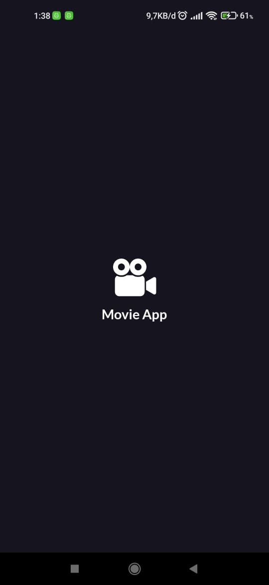
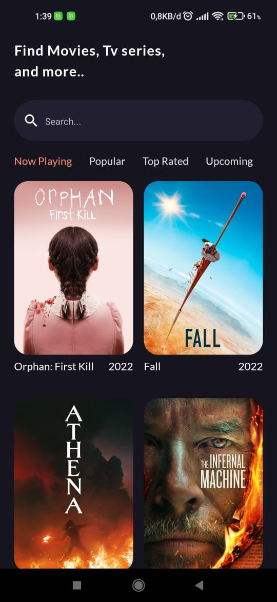
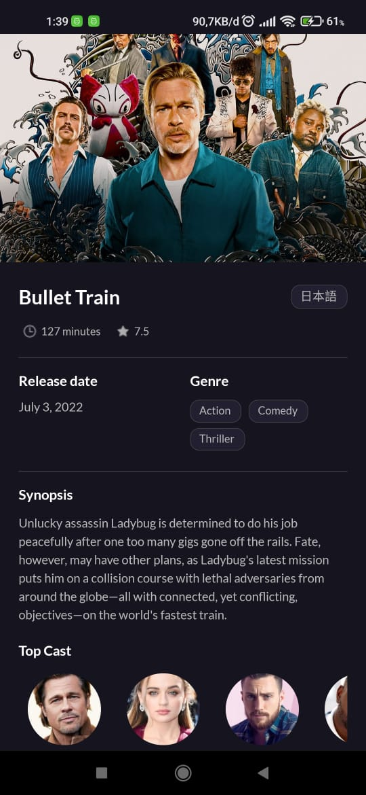
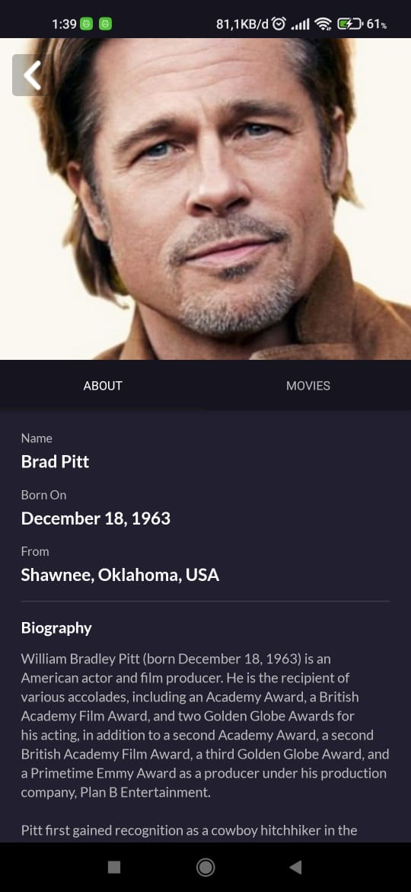
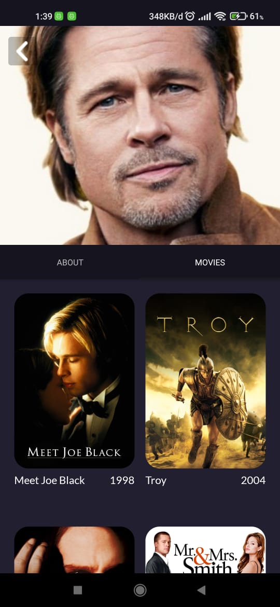

<h1 align="center">Movie App</h1>

  Built with React Native

## Table of Contents

- [Introduction](#introduction)
- [Features](#features)
- [Requirements](#requirements)
- [Usage](#usage-for-development)
- [Screenshot](#screenshot)
- [Release APK](#release-apk)
- [Contact](#contact)

## Introduction

<b>Movie App</b> is a Mobile application that can be used to see list & detail of the movies and the actors. Users that can search movie.

## Features

- Users can see list movies
- Users can see detail a movie & an actor
- Users can search movie
- And others

## Requirements

- [`npm`](https://www.npmjs.com/get-npm)
- [`react-native`](https://facebook.github.io/react-native/docs/getting-started)
- [`react-native-cli`](https://facebook.github.io/react-native/docs/getting-started)
- [`yarn`](https://classic.yarnpkg.com/lang/en/docs/install/#windows-stable)

## Usage for development

1. Open your terminal or command prompt
2. Type `git clone https://github.com/enalmarzuki/MovieApp.git`
3. Open the folder and type `yarn install` for install dependencies
4. Type `npx react-native run-adroid` for run this app. **_Make sure your device is connected with debugging mode_**.

## Screenshot Here

       
    
         

    
    

## Release APK

## Contact

If you want to contact me you can reach me at <enalmarzuki07@gmail.com>.

Copyright © 2022 by Marzuki
